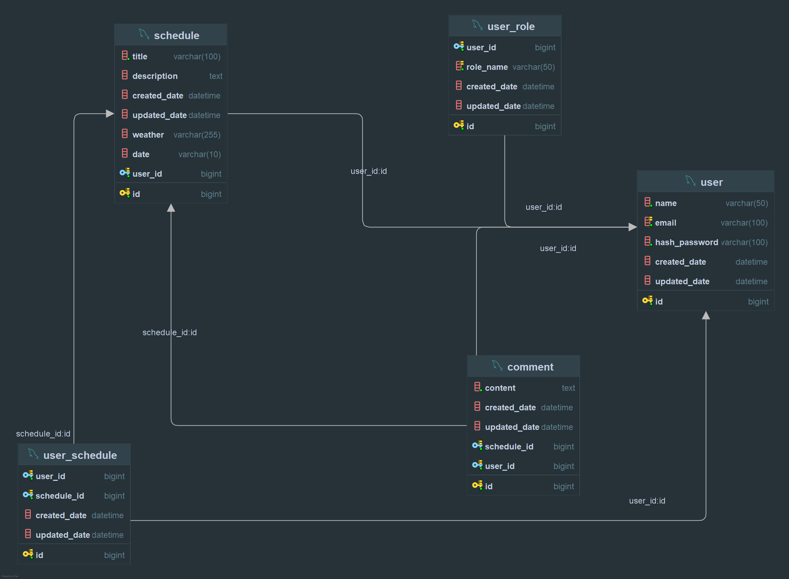

# 개요
일정 관리 애플리케이션의 서버 측 구현이 목표인 프로젝트로 
회원가입 및 로그인 , jwt를 통한 토큰 인증과 
사용자는 일정을 생성, 조회, 수정, 삭제할 수 있으며, 
각각의 일정은 특정 담당자와 연관되어 관리됩니다. 
또한 관리자는 사용자에게 권한을 부여할 수 있고 
기본적인 댓글 기능과 일정에도 담당자들을 할당 할 수 있습니다. 
RESTful API 원칙 준수를 노력하였으며, Spring Boot를 기반으로 구현되었습니다. 
데이터베이스는 MySQL을 사용하여 일정 및 담당자 정보를 저장하고 관리합니다. 

## 프로젝트의 목적
이 프로젝트의 주요 목적은 
RESTful API를 통해 기본적인 일정 관리에 필요한 기능을 제공하는 
서버 애플리케이션을 구축하는 것입니다. 
실제로 프론트엔드 관련 정적 파일 제공 작업은 포함되지 않으나, 
클라이언트로부터 일정과 관련된 요청을 받아 처리하며, 
작업을 수행한 후 JSON 형식으로 요청에대한 응답을 가정하며 설계되었습니다. 
또한, 스프링 시큐리티에 대한 의존성을 줄이고 싶어 
스프링 시큐리티를 지향하며 설계되었습니다. 

# 주요 구성 및 역할
## 회원가입 및 인증 서비스
AuthController는 사용자의 로그인과 회원가입 요청을 처리하는 역할을 합니다. 
AuthService 인터페이스와 그 구현체 AuthServiceImpl는 실제 인증 로직을 처리하며, 
JWT 토큰을 이용한 인증 및 권한 부여 기능을 제공합니다. 

## 댓글 및 일정 관리
CommentController와 ScheduleController는 각각 일정에 대한 댓글과 일정을 관리합니다. 
CommentService와 ScheduleService는 비즈니스 로직을 처리하며, 
CommentRepository와 ScheduleRepository는 데이터베이스와의 상호작용을 담당합니다. 
댓글과 일정은 Comment와 Schedule 클래스에 의해 모델링되며, 
DTO(Data Transfer Object)와 Mapper를 통해 데이터 전송 및 변환이 이루어집니다. 

## 유저 및 권한 관리
UserController는 사용자 정보 관리를 담당하며, 
UserService와 UserRepository를 통해 
사용자 데이터의 CRUD(Create, Read, Update, Delete) 작업을 처리합니다. 
사용자의 권한 관리는 UserRoleController, UserRoleService, UserRoleRepository를 통해 이루어지며, 
각 권한은 RoleName 열거형(eums)과 UserRole 클래스에 의해 관리됩니다. 

## 보안 및 JWT 토큰 관리
JwtAuthorizationFilter와 JwtTokenProvider는 JWT 기반의 보안 기능을 제공합니다. 
이들은 HTTP 요청에서 JWT 토큰을 추출하고 검증하여 사용자의 권한을 확인합니다. 
JwtAuthorizationUtil은 다양한 역할 검증 로직을 포함하여 
관리자가 아닌 사용자에게 특정 기능을 제한하는 데 사용됩니다. 

## 예외 및 로깅
AccessDeniedException 등 여러 예외 클래스는 
다양한 오류를 처리하기 위해 커스텀화하여 사용됩니다. 
이 예외 클래스들은 BaseException을 상속받아 공통 기능을 공유하며, 
GlobalExceptionHandler는 중앙 집중식 예외 처리를 제공하여 
모든 컨트롤러에서 발생하는 예외를 처리하고,적절한 HTTP 응답을 반환합니다. 
ServiceLoggingUtil은 각 서비스에서 로그를 기록하는 기능을 제공하여 애플리케이션의 문제를 추적하는 데 도움이 됩니다. 

## 아키텍처
프로젝트는 3 Layer Architecture 구조를 채택하고있으며, 
각 레이어는 다음과 같은 역할을 수행합니다 

### Controller Layer
클라이언트의 요청을 처리하고, 서비스 레이어에 작업을 위임하며, 최종 응답을 반환합니다. 
### Service Layer
비즈니스 로직을 담당하며, 컨트롤러와 데이터베이스 레이어 간의 중간 역할을 합니다. 
### Repository Layer
데이터베이스와의 상호작용을 처리하며, 
JPA를 사용해 데이터의 저장, 조회, 수정, 삭제를 수행합니다. 

# QnA
다음은 다른분들에게 프로젝트에 관한 질문들에 대한 간략한 답변입니다. 

### Q : H2 사용 안하시는 이유가 있나요?
A : H2를 사용하면 보다 편하게 테스트 할 수 있지만 역으로 개발툴에 내장된 데이터베이스 관리나 
    워크벤치등을 통해 보다 직접적으로 연습해보기 위함입니다. 

### Q : 브랜치에 커밋 기록이 자세하다가 갑자기 한번에 구현된 이유가 있나요? 
A : 저번 프로젝트때 주요 지점에서 커밋을 까먹어서 고생해던 적이 있어서 
    이번에는 꼼꼼한 커밋 메세지 작성도 좋겠지만 앞에 질문의 답과 마찬가지로 
    역으로 커밋을 잊어버렸을때를 대비하기위해 인텔리제이에 내장된 로컬 히스토리 기록으로 
    복구 , 조정 , 히스토리 기록의 백업 등을 연습하기 위함입니다. 

# 다이어그럼 및 문서 링크
첫 설계때와 많이 달라져서 갱신하는대 시간이 많이 필요할 것 같습니다... 
API 명세서는 시트 갱신 완료 까지 .http파일로 대체합니다. 
루트 최상단 API_Request_Examples.http 파일을 사용해 주세요. 

구글 시트 링크 : 추후 갱신 예정

